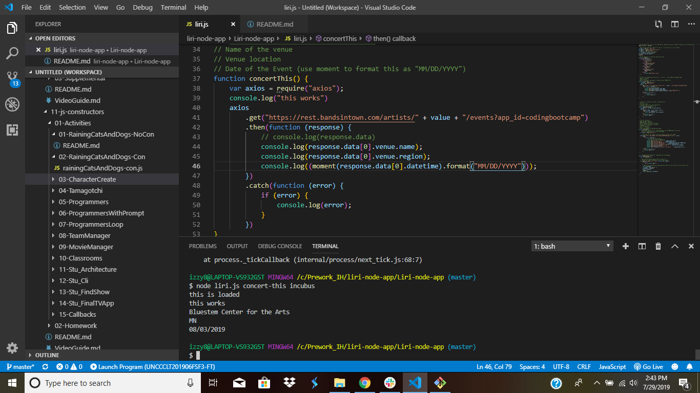
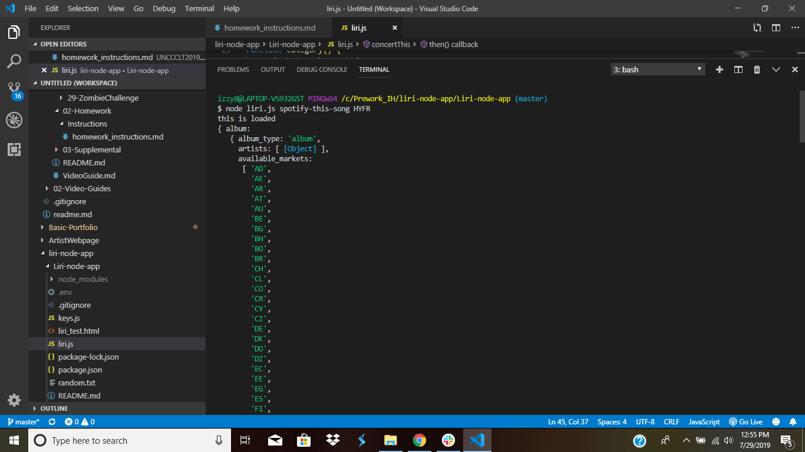
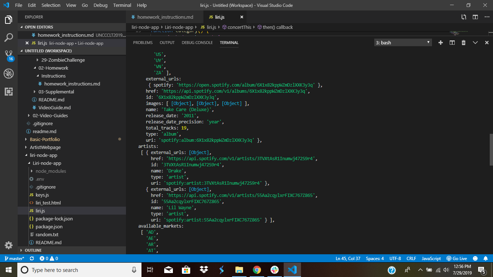
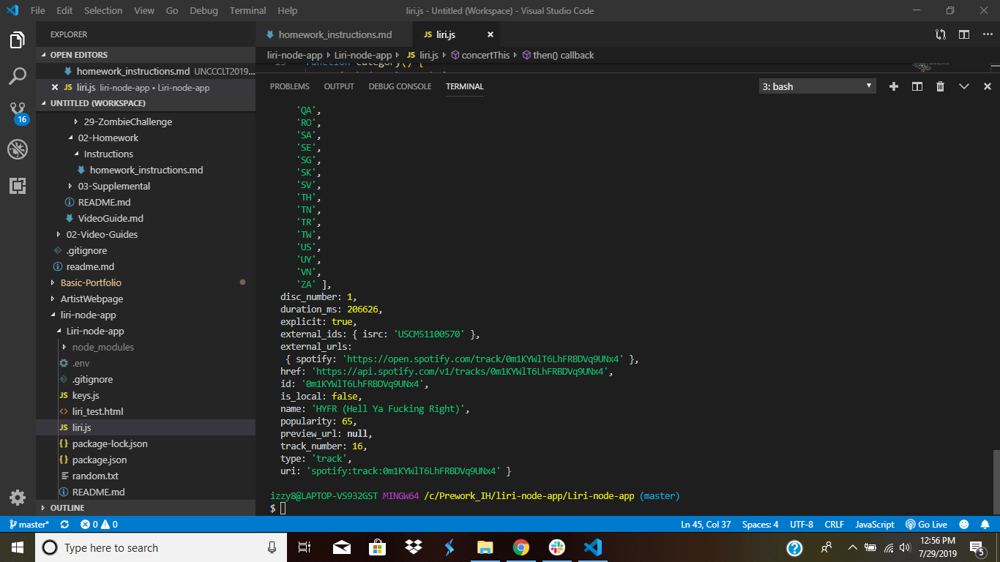
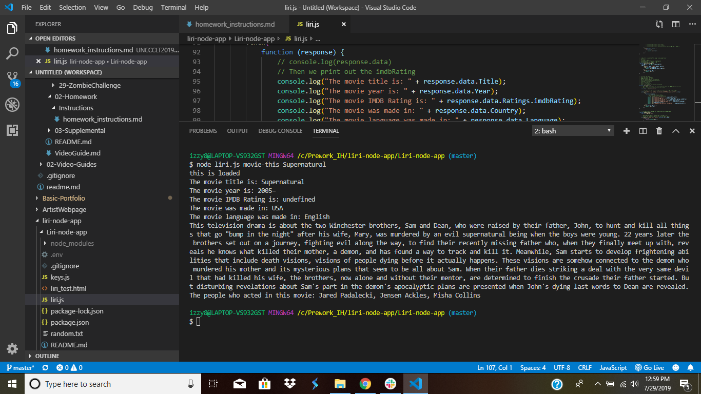
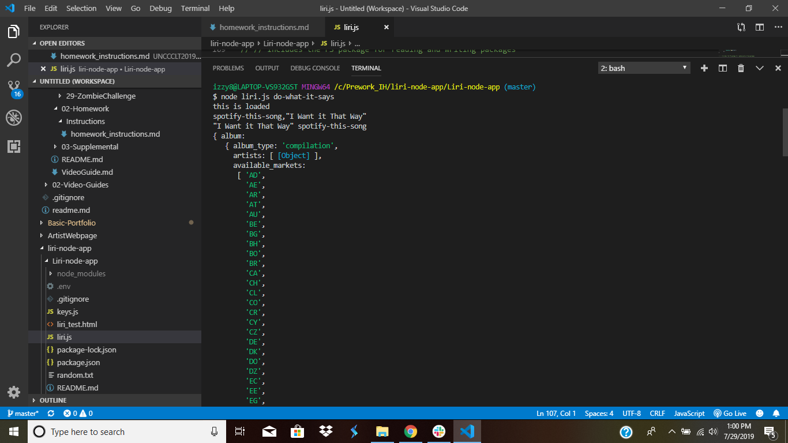
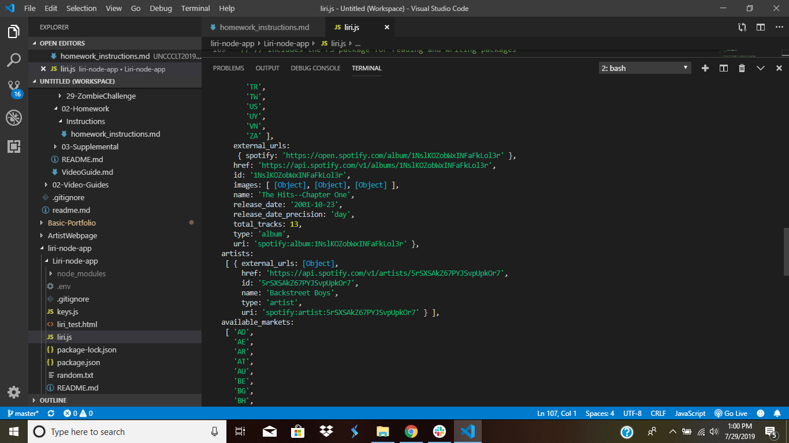
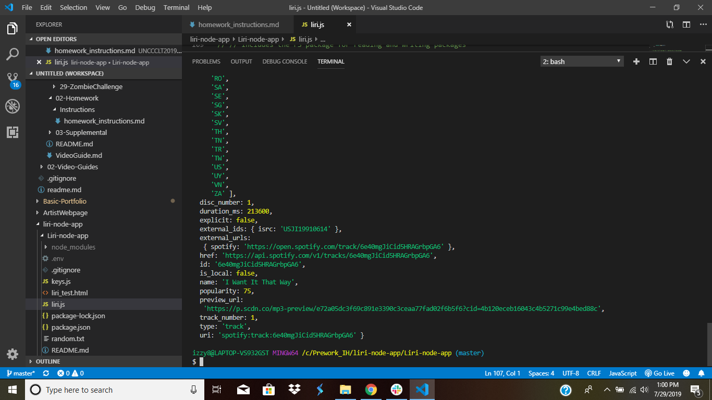
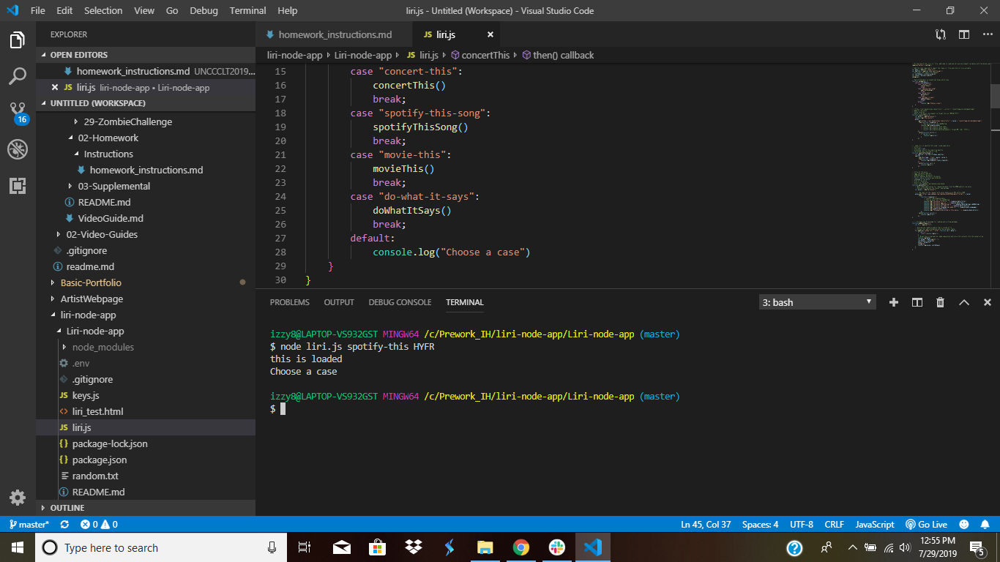

# Liri-node-app

LIRI is like iPhone's SIRI. However, while SIRI is a Speech Interpretation and Recognition Interface, LIRI is a _Language_ Interpretation and Recognition Interface. LIRI will be a command line node app that takes in parameters and gives you back data.

Command Line:
* concert-this
* spotify-this-son
* movie-this
* do-what-it-says

# Purpose of Liri

LIRI will search Spotify for songs, Bands in Town for concerts, and OMDB for movies.

# I use these to retrieve the data that will power this Liri.

* [Node-Spotify-API](https://www.npmjs.com/package/node-spotify-api)
* [Axios](https://www.npmjs.com/package/axios)
* You'll use Axios to grab data from the [OMDB API](http://www.omdbapi.com) and the [Bands In Town API](http://www.artists.bandsintown.com/bandsintown-api)
* [Moment](https://www.npmjs.com/package/moment)
* [DotEnv](https://www.npmjs.com/package/dotenv)

# How To Use Liri
1. First step is you Open Bash in the Liri-node-app.
2. Next, you choose a case that you want to do.

- First Case, we are going to type in concert-this<br>
```node liri.js concert-this (bandname)``` <br>
Output: It will show the Venue, Name of Venue, and Date of Venue


- Second Case, we are going to type in spotify-this-song<br>
```node liri.js spotify-this-song (songname)``` <br>
Ouput: It will show the Artist, Song Name, the Album of the song it's on




- Next Case, we are going to type in movie-this<br>
```node liri.js movie-this (bandname)``` <br>
Output: It will show the Title, Year, IMDB Rating, Country, Language, Plot of the movie


- Fourth Case, we are going to type in do-what-it-says<br>
```node liri.js do-what-it-says (bandname)``` <br>
Output: It will show the what's in the randam.text file




-Last Case, is the default case incase you type the wrong case or misspell something


# Files Used
- .env
- .gitignore
- keys.js (Spotify keys)
- liri.js (function of the liri)
- package.json
- package-lock.json
- random.txt

# Creator of App
Israel Harvin 7/29/2019
